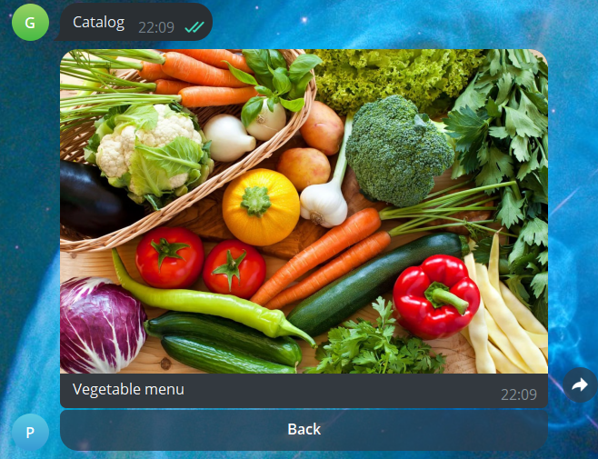
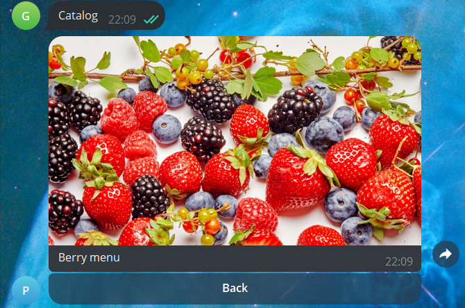
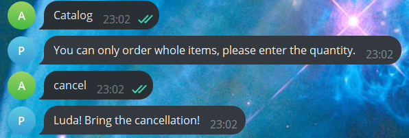
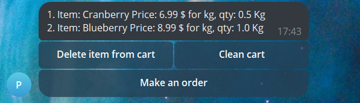
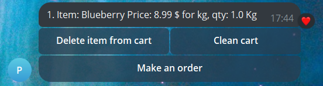
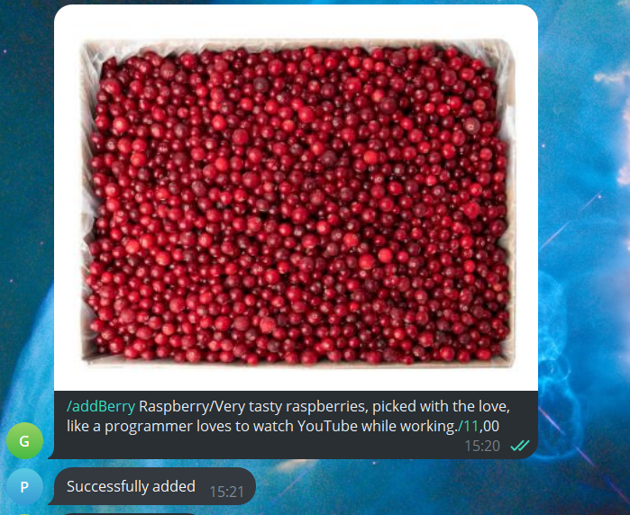
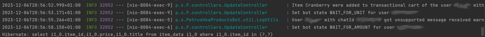

# Telegram bot for an online store of vegetables and fruits "Petrushka"

Petrushka Products Bot  is a Telegram bot designed to help users browse, select, and order fresh 🥦 vegetables, fruits, herbs and berries. The bot provides a user-friendly interface to explore the catalog, add items to the cart, and place orders for delivery.

## Table of Contents
* [Backstory](#backstory)
* [Overview](#overview)
	+ [Technologies](#technologies)
	+ [Key Features](#key-features)
* [Functionality](#functionality)
	+ [User side](#user-side)
		- [Selection of products](#selection-of-products)
		- [Adding to cart](#adding-to-cart)
		- [Editing cart](#editing-cart)
		- [Checkout process](#checkout-process)
	 + [Admin side](#admin-side)
		 - [Adding a new product](#adding-a-new-product)
		 - [Aditing a product](#editing-a-product)
		 - [Work with configuration file](#work-with-application.properties-file)
		 - [Logs](#logs)
		 - [Receiving a client's order](#receiving-a-client's-order)
	* [Conclusion](#conclusion)
	

 

## Backstory

I made this bot to order for one vegetable and fruit store in Minsk, with a 30% prepayment. When I finished it (in 2 weeks), its owner decided to leave for another business.
So I decided to add this bot to my resume.

### If you are HR and want to see this bot in action, write me on [LinkedIn](https://www.linkedin.com/in/aliaksei-shakhner-25122b247/) and I will launch it in a couple of minutes for you.

This is my biggest project, please don’t judge me too harshly, I tried really hard 😊.

## Overview
This bot facilitates a shopping experience for users, allowing them to interact with the catalog, add items to their cart, and complete orders. 
To add, remove products, edit their prices, the administrator does not need to understand the code, all this is done literally by pressing few buttons.
The bot is also equipped with an anti-spam system and does not break down when changing incompatible states.
Also, the entire cache system is made self-cleaning, so the administrator does not have to worry about it.
I ask you to fully assess the functionality of the bot, this is my biggest project.

---------------
### Technologies
The bot was written in Java, using the Spring Framework, Hibernate.
Database - PostgreSQL. Postman and ngrok are used for testing.
The Telegram bot work on REST requests.

---------
### Key Features
The main advantage of this bot is its ease of use, accessibility, you do not need to download other applications or go to third-party sites and its durability.
It does not fall when switching incompatible states, all errors are caught, there is an anti-spam system so that attackers cannot harm the system.
I also tried to make it as easy to use as possible, even my grandma learned how to use it and as far as i know, that is good sign😄.

## Functionality
To interact with the bot, I chose the strategy of updating one message, rather than sending a new one every time bot get new request. This way the chat doesn’t get clogged and it’s more difficult to click where you don’t need to 😊. 

### User side
Let's start with the main functions for users

---
#### Selection of products

To get the main catalog, you need to use the relevant button.
How to use the bot is, of course, described the first time you contact it, so you don’t need to read the readme file😁, but I don’t see the point in showing introductory messages and other not very important things.

  

Next, the user must select the required section.
As an example, I give a catalog of vegetables and berries.
As you can see, each section has its own picture, to change it - just replace the [fileId](#work-with-application.properties-file) of the [corresponding section](#work-with-application.properties-file), the bot will download and insert the picture automatically!

	
Empty vegetables catalog | Empty berries catalog
:-: | :-:|
 | 

Here I will show you an example of an empty catalog. Only an admin can [add a product](#adding-a-new-product) . To [add an admin](#work-with-application.properties-file), just add his chatId to the application.properties file.

Here is an example of a berry catalog consisting of 1, 2 and 3 products respectively. The list builds **automatically**, you do not need to add rows and columns manually.

|  |   |    |
|:--------:|:--------:|:--------:|

The product page consists of it's name, price and description, as well as a personal picture, which is stored in the database. How to [add a product](#adding-a-new-product) is discussed in the relevant chapter.
I would like to note that the personal product page for the admin and for the user is [different](#editing-a-product).

  

You can go back from any part of the catalog, one certain message will be updated so the chat will not be clogged.

For example, you have an “stale catalog” in your chat with the bot, because an admin removed some product and of course it is technically difficult to update all already received messages with catalogs, implementation will require a LOT of memory, storing the messageId of all catalogs in cache. 
If you try to go to the personal page of "stale product", add it to your cart, if you already have its personal page open in the chat or amke an order with such an item: the bot will send you a corresponding message.

The same will be sent to user when ordering a deleted product in the cart.

---

#### Adding to cart
So when you have chosen a product, it’s time to add it to your cart. 
To do this, on the product page, click the **add to cart** button, and the bot will prompt you to choose the unit of measurement, kilograms or by the piece.

Then you need to enter the quantity. Please note that if you enter a non-integer numeric when selecting pcs unit, the bot will display a corresponding message.
integer when kg selected|integer when pcs selected
:-:|:-:
 | 

Please note that the number can be indicated with a period or a comma, everything is thought out😁.

If you add a product to your cart that is already in, it will be added to the existing one, **If the units of measurement match**. If not, the bot will send the appropriate message.

You can always left from any step adding to a cart , just send "cancel" to the bot.

For example, you are in the process of selecting units of measurement, but you pressed any other button that does not work in this state, then the bot will simply cancel the process and send the catalog again.

	

	
In general, the bot catches a lot of exceptions, so that the bot does not break😇. It makes no sense to tell in detail about everything, as not to stretch this file 10 times.
So, you have added several products to your cart.

---
#### Editing cart

If you accidentally added a product to your cart that you do not need or want to completely empty your cart, click the "My cart" button

Empty cart | Cart with products
:-:|:-:
 | 

Now click "Delete item from cart" and then enter the ordinal number of the product in your cart
Removal process|Result
:-:|:-:
 | 

If you want to completely empty your cart, just click the relevant button

---
#### Checkout process

To make an order, you just need to click the "Make an order" button and follow the bot's instructions. Please note that the number is validated as Belarusian through a **regex** expression, but this changes very quickly to the type of numbers of any country.

Example:

	

Done! Now the manager can call you and confirm the order.
My client asked that the bot not calculate the price, because If you order goods by pcs, you don’t know how much they will weigh.

You cannot order more than 15 products or more than 100 kilograms, the bot will warn you what to do.

Example:

	

The manager number is also very simply set in an [external file](#work-with-application.properties-file).

There are still many restrictions and features, there is no point describe  them all, as i said before, all exceptions are caught.

### Admin side
---
#### Adding a new product

To add a new product, you need to send a picture that this product will have and enter a command corresponding to the type of product, its description and price.
The bot will do everything automatically. If the command is entered incorrectly, the bot will prompt you how to enter the command correctly.

**Berries**
/addBerry ProductName/Description/Price

**Vegetables**
/addVegetable ProductName/Description/Price

**Fruits**
/addFruit ProductName/Description/Price

**Herbs**
/addHerb ProductName/Description/Price

You can specify the price separated by a period or a comma of your choice.
If this is done by a user and not an administrator, he will receive an error message.

Correction proposal for admin | Non-admin user attempt to add
:-:|:-:
 | 

**Product successfully added:**

---
#### Editing a product

If you are an admin, the product page will be different, you can delete the product and/or edit its price.

Example:

Changing price process and its result:

The administrator can also cancel any process like [here](#cancellation)

---
#### Work with application.properties file

To add a new admin, simply enter his chatId in the admin line. If there are several admins, enter their chatIds separated by commas.
To change the manager number, change the value of the corresponding line of the file.
Also here you can indicate the fileId of the pictures of the corresponding product sections.

To get an fileId of a new image, send to the bot the image with a question mark.

**Example:**

All bot caches are cleared automatically (including  users carts).

---
#### Logs

Updates of states, baskets, and receiving of messages are logged, as everything else.

---

#### Receiving a client's order

Admins receive orders in this format:

And after that they can immediately call to client and talk the details)

If a product is no longer on sale, the bot will work as in <a href="#stale-product">this</a> case and also remove the outdated product from the cart.

## Conclusion

Thank you for your interest in my bot, if you have any questions or want to contact me, feel free to text me on LinkedIn
[Aliaksei Shakhner | LinkedIn](https://www.linkedin.com/in/aliaksei-shakhner-25122b247/)
[Or telegram](https://t.me/pressure_sensor)

